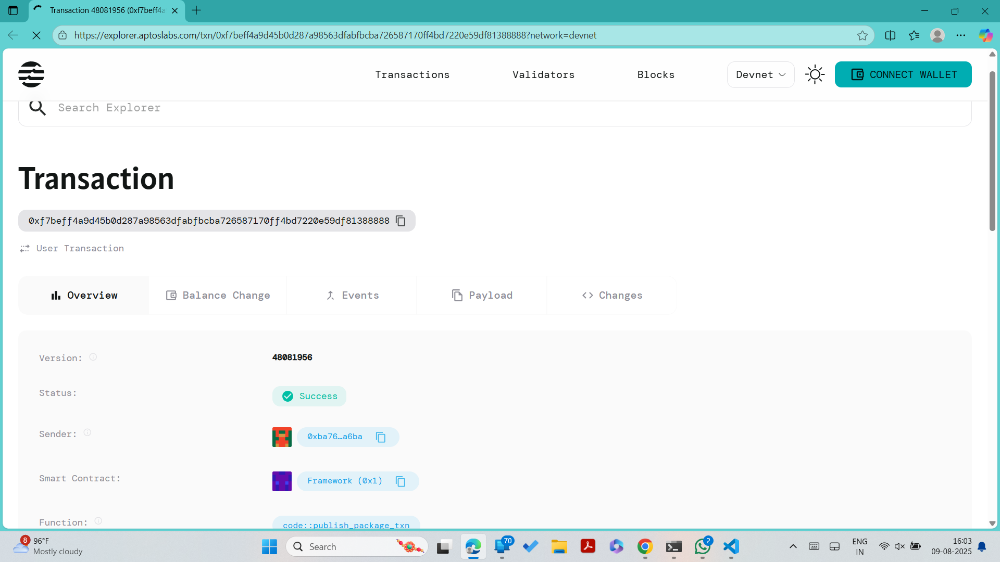

# Gas Optimization Tools

## Project Title
Gas Optimization Tools

## Project Description
Implement gas usage optimization utilities that help users reduce transaction costs on the Aptos blockchain. This smart contract provides tools to track gas usage patterns, execute batch operations efficiently, and implement optimization strategies that minimize computational overhead. The system monitors user operations and provides insights into gas savings achieved through various optimization techniques.

## Project Vision
To create a comprehensive suite of gas optimization tools that empower developers and users to minimize transaction costs on the Aptos blockchain. Our vision is to make blockchain interactions more affordable and accessible by providing intelligent optimization mechanisms that automatically reduce gas consumption without compromising functionality or security.

## Key Features
- **Gas Tracking System**: Monitors and records gas usage patterns for individual users
- **Batch Operation Processing**: Combines multiple operations into single transactions to reduce overhead
- **Optimization Level Scaling**: Dynamic optimization levels that improve based on user activity
- **Real-time Gas Savings Calculation**: Tracks cumulative gas savings achieved through optimizations
- **Efficient Data Storage**: Minimized on-chain storage to reduce state rent costs
- **Automated Optimization**: Smart algorithms that automatically apply best practices
- **Cost Analytics**: Detailed insights into gas consumption patterns and savings opportunities

## Future Scope
- **Advanced Batching Algorithms**: Implement sophisticated batching strategies for different operation types
- **Gas Price Prediction**: Integrate predictive models to optimize transaction timing
- **Cross-Contract Optimization**: Tools for optimizing gas usage across multiple smart contract interactions
- **Layer 2 Integration**: Seamless integration with Layer 2 solutions for additional cost savings
- **Gas Token Implementation**: Create gas tokens that can be pre-purchased during low-cost periods
- **Machine Learning Optimization**: AI-driven optimization recommendations based on usage patterns
- **Developer SDK**: Comprehensive toolkit for developers to integrate gas optimization into their dApps
- **Gas Refund Mechanisms**: Implement partial gas refunds for highly optimized transactions
- **Community Optimization Pool**: Shared optimization strategies and community-driven improvements
- **Enterprise Solutions**: Specialized tools for high-volume enterprise blockchain operations

## Contract Details
*[This section will be filled by the developer with specific technical implementation details, deployment addresses, and usage instructions.]*

0xf7beff4a9d45b0d287a98563dfabfbcba726587170ff4bd7220e59df81388888